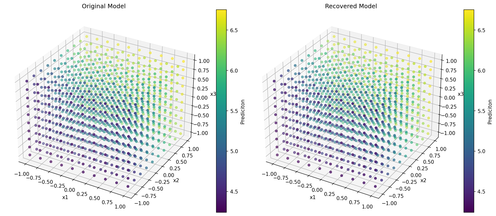
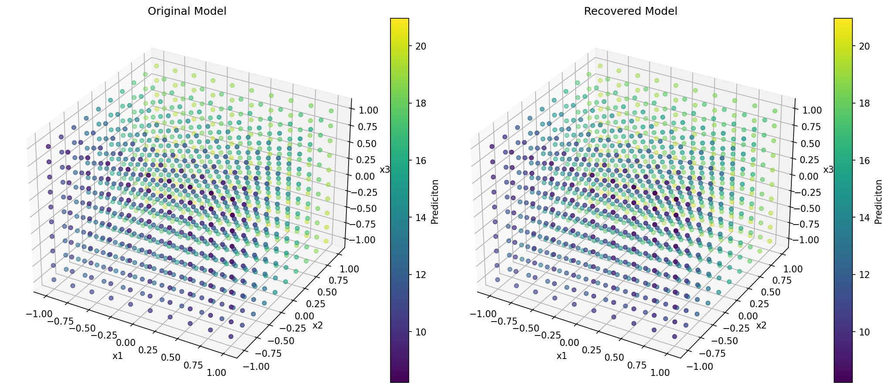

# Problem 1: Linear Regression Model Recovery

## Objective

The objective is to reverse engineer a black-box linear regression model that accepts three input features and returns a continuous prediction through `model.predict(X)`.

The assumed model equation is

$$
f(x_1,x_2,x_3)=b+w_1x_1+w_2x_2+w_3x_3,
$$

where $b$ is the intercept and $w_1,w_2,w_3$ are the feature coefficients. The internal attributes of the supplied models, such as `coef_` and `intercept_`, are not accessed.

The implementation is organized in the `RE` class. The supplied model is passed to the constructor and stored as `self.model`, allowing every function to perform experiments on the same black-box model.

## Task 1: Recover the Intercept

The `recover_intercept()` function queries the model using one all-zero input:

$$
X=[0,0,0].
$$

Substituting this input into the model equation gives

$$
f(0,0,0)=b+w_1(0)+w_2(0)+w_3(0)=b.
$$

Therefore, the prediction at the origin directly gives the intercept. The function returns this prediction as a scalar floating-point value.

The recovered intercepts are:

| Model | Recovered intercept |
| --- | ---: |
| Concrete-strength model | $5.495909269228676$ |
| Boston-housing model | $14.588099261571019$ |

## Task 2: Recover the Coefficients

The `recover_coefficients()` function queries the model at the origin and the three unit vectors:

| Input | Model prediction |
| --- | --- |
| $[0,0,0]$ | $b$ |
| $[1,0,0]$ | $b+w_1$ |
| $[0,1,0]$ | $b+w_2$ |
| $[0,0,1]$ | $b+w_3$ |

Subtracting the prediction at the origin removes the intercept:

$$
\begin{aligned}
w_1 &= f(1,0,0)-f(0,0,0),\\
w_2 &= f(0,1,0)-f(0,0,0),\\
w_3 &= f(0,0,1)-f(0,0,0).
\end{aligned}
$$

This experiment changes one feature by one unit while keeping the other two features equal to zero. For an affine linear model, the corresponding change in prediction is exactly that feature's coefficient.

The function returns the recovered coefficients as a NumPy array of shape `(3,)`.

| Model | $w_1$ | $w_2$ | $w_3$ |
| --- | ---: | ---: | ---: |
| Concrete-strength model | $0.06772012$ | $1.08693769$ | $0.10019308$ |
| Boston-housing model | $-0.56712588$ | $4.93311836$ | $-0.86709475$ |

## Task 3: Estimate Model-Recovery Error

The `estimate_model_error(samples=100, seed=42)` function generates 100 reproducible random input points. Each feature is independently sampled from the interval $[-1,1]$:

$$
X\sim U([-1,1]^3).
$$

For every input point, two predictions are calculated:

1. The black-box prediction returned by `model.predict(X)`.
2. The recovered prediction calculated using

$$
\hat y_{\text{recovered}}=b+Xw.
$$

The recovery mean squared error is

$$
\operatorname{MSE}_{\text{recovery}}
=\frac{1}{n}\sum_{i=1}^{n}
\left(
\hat y_{\text{model}}^{(i)}-
\hat y_{\text{recovered}}^{(i)}
\right)^2.
$$

A recovery MSE close to zero means that the recovered equation reproduces the black-box predictions over the sampled region.

The function also calculates the variance of the two sets of predictions:

$$
\operatorname{Var}(\hat y)
=\frac{1}{n}\sum_{i=1}^{n}
\left(\hat y^{(i)}-\overline{\hat y}\right)^2.
$$

Similar black-box and recovered prediction variances provide additional evidence that both models behave similarly over the sampled inputs.

### Experimental Results

| Model | Recovery MSE | Black-box prediction variance | Recovered prediction variance |
| --- | ---: | ---: | ---: |
| Concrete-strength model | $1.262177448353619\times10^{-31}$ | $0.4736424504723761$ | $0.47364245047237624$ |
| Boston-housing model | $3.250106929510569\times10^{-30}$ | $9.69665795817081$ | $9.696657958170817$ |

Both recovery MSE values are effectively zero. For both models, the black-box and recovered prediction variances agree up to floating-point precision. Therefore, the recovered equations reproduce both the individual predictions and their variation over the sampled region.

The Boston-housing model has greater prediction variance than the concrete-strength model over $[-1,1]^3$. This comparison describes only the selected probing range and does not, by itself, show that the Boston-housing model has high statistical variance.

### Limitation

The calculated MSE is the error between the black-box predictions and the recovered-model predictions. It is not the original training or test MSE because the true target values are not available to these functions. Determining the original prediction error would require the corresponding dataset inputs and ground-truth targets.

## Task 4: Detect Non-linearity and Feature Interactions

The `detect_nonlinearity(tolerance=1e-6)` function performs two experiments. The helper function `predict_one(x)` converts one point into the two-dimensional array shape required by `model.predict()` and returns its scalar prediction.

### Constant-Slope Test

For feature $i$, the recovered coefficient represents the prediction change from 0 to 1:

$$
w_i=f(e_i)-f(0),
$$

where $e_i$ is the unit vector for feature $i$. The function compares this value with the prediction change from 1 to 2:

$$
f(2e_i)-f(e_i).
$$

For a linear model, both changes must be equal. Therefore, the tested difference is

$$
D_i=f(2e_i)-f(e_i)-w_i.
$$

If $|D_i|$ is greater than $10^{-6}$, the feature is reported as potentially nonlinear. A changing slope can indicate a term such as $x_i^2$, $x_i^3$, or another nonlinear transformation.

### Pairwise-Interaction Test

For every pair of features $(i,j)$, the following cross-difference is calculated:

$$
D_{ij}=f(e_i+e_j)-f(e_i)-f(e_j)+f(0).
$$

For the assumed linear model,

$$
\begin{aligned}
D_{ij}
&=(b+w_i+w_j)-(b+w_i)-(b+w_j)+b\\
&=0.
\end{aligned}
$$

If $|D_{ij}|$ exceeds the tolerance, the effect of one feature depends on the value of another feature, indicating a possible interaction term.

The function returns the features that fail the slope test, the feature pairs that fail the interaction test, and a Boolean value indicating whether any evidence of non-linearity was detected.

### Experimental Results

| Model | Nonlinear features | Feature interactions | Nonlinear-model flag |
| --- | --- | --- | --- |
| Concrete-strength model | `[]` | `[]` | `False` |
| Boston-housing model | `[]` | `[]` | `False` |

No changing slopes or pairwise interactions were detected at the tested points for either supplied model. These results are consistent with both black boxes being affine linear regression models. Since only a finite number of points are tested, the experiment provides evidence of linearity over those probes rather than a proof of global linearity for every possible input.

## Model-Behaviour Visualization

The `plot_model_behaviour()` function creates a three-dimensional grid using 20 values for each feature over $[-1,1]$. Each point's coordinates represent $(x_1,x_2,x_3)$, while its colour represents the predicted output.

Two 3D scatter plots are displayed:

1. Predictions obtained directly from the black-box model.
2. Predictions calculated using the recovered intercept and coefficients.

Matching colour patterns in the two panels visually support the numerical recovery results.

### Concrete-strength model

### Boston-housing model

## Final Analysis

### Concrete-strength Model

The recovered equation is approximately

$$
\hat y
=5.49590927
+0.06772012x_1
+1.08693769x_2
+0.10019308x_3.
$$

All three coefficients are positive, so increasing any feature increases the predicted output when the remaining features are fixed. Feature 2 has the largest coefficient magnitude and therefore produces the largest prediction change per unit increase in this input representation.

The recovery MSE is approximately $1.26\times10^{-31}$, and the recovered prediction variance matches the black-box variance. No evidence of nonlinear feature behaviour or pairwise interaction was detected.

### Boston-housing Model

The recovered equation is approximately

$$
\hat y
=14.58809926
-0.56712588x_1
+4.93311836x_2
-0.86709475x_3.
$$

Feature 2 has a positive coefficient and the largest magnitude. Features 1 and 3 have negative coefficients, so increasing either of those features decreases the prediction when the other features are fixed.

The recovery MSE is approximately $3.25\times10^{-30}$, and the recovered prediction variance again matches the black-box variance. No evidence of nonlinear feature behaviour or pairwise interaction was detected.

Overall, the near-zero recovery errors, identical prediction variances, empty non-linearity results, and matching visualizations show that the recovered equations accurately reproduce both supplied black-box models over the tested input ranges.
