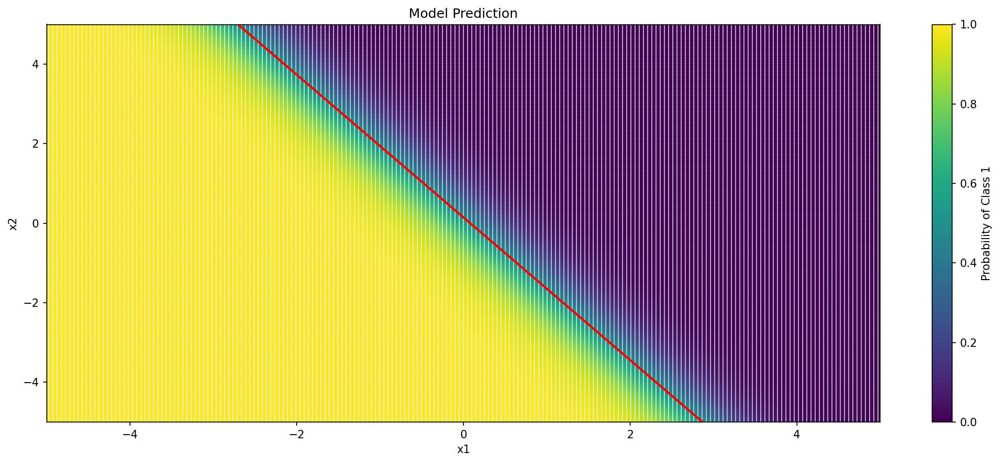
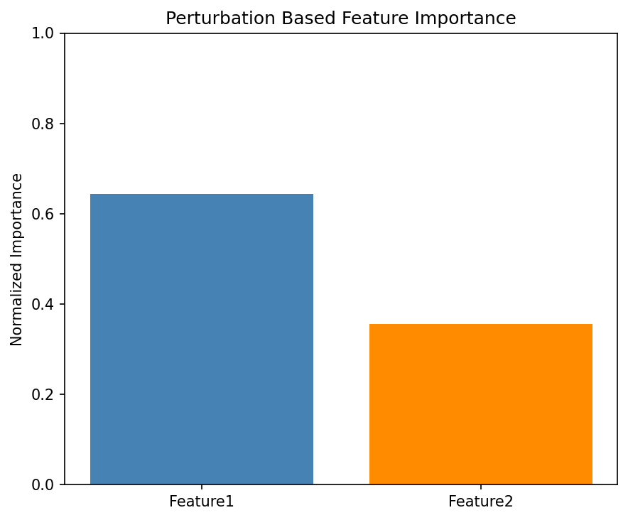
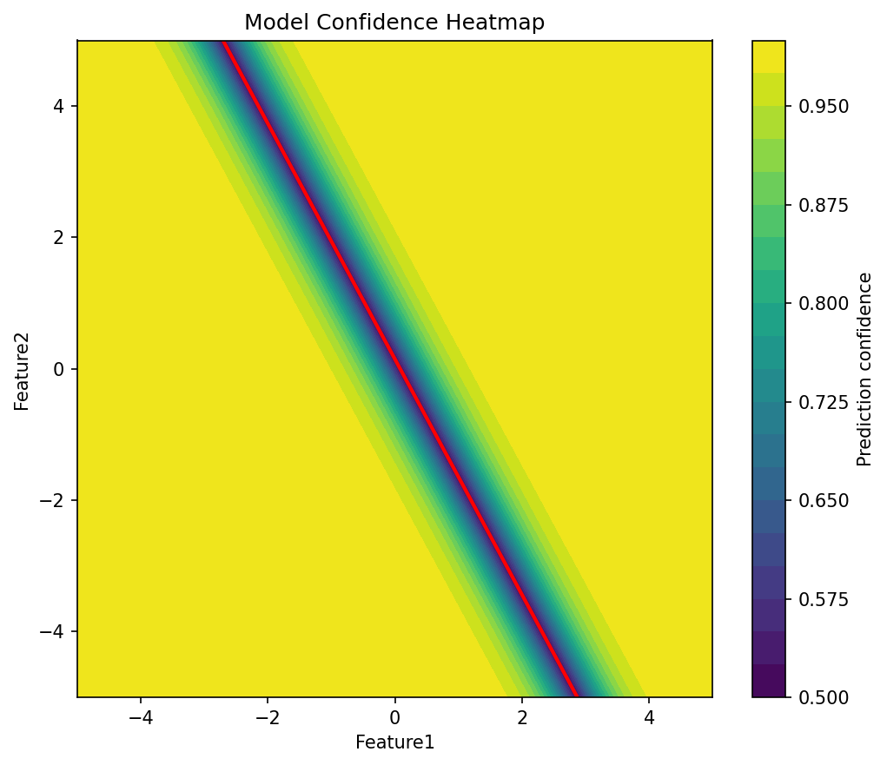
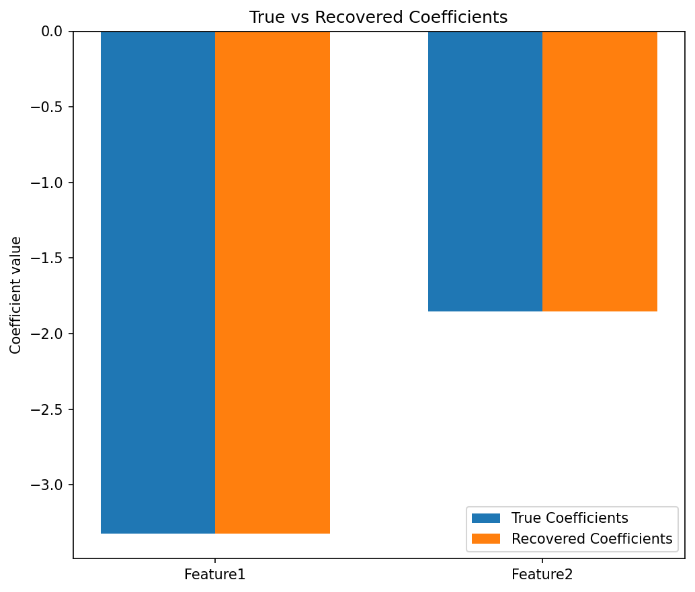

# Problem 2: Logistic Regression Decision Boundary Discovery

## Objective

The objective is to reverse engineer a black-box binary classification model with two input features. The model provides the predicted class through `model.predict(X)` and the class probabilities through `model.predict_proba(X)`.

The assumed logistic regression equation is

$$
P(y=1\mid x)=\frac{1}{1+e^{-(b+w_1x_1+w_2x_2)}},
$$

where $b$ is the intercept and $w_1,w_2$ are the two feature coefficients. The implementation is organized in the `RE` class, and the supplied model is stored as `self.model` when an object of this class is created.

The experiments use the input range $[-5,5]$ for both features. Therefore, this implementation assumes that the model accepts features in this range, for example standardized or transformed features.

## Helper Functions

### `class1_prob(X)`

This function calls `model.predict_proba(X)` and returns the second column, which contains the probability of class 1:

$$
P(y=1\mid x).
$$

### `prob_to_logit(prob)`

The probabilities are converted into logits using

$$
\operatorname{logit}(p)=\log\left(\frac{p}{1-p}\right).
$$

The probabilities are clipped to the interval $[10^{-10},1-10^{-10}]$ before applying the logarithm. This prevents division by zero and the logarithm of zero.

### `sigmoid(X)`

This function converts logits back into probabilities using

$$
\sigma(z)=\frac{1}{1+e^{-z}}.
$$

## Task 1: Grid-Based Decision Boundary Search

The `plot_decision_boundary()` function creates 200 equally spaced values for both $x_1$ and $x_2$ over $[-5,5]$. `np.meshgrid()` forms every possible pair, producing a grid of 40,000 input points.

For every grid point, the following values are obtained:

1. The class predicted by `model.predict(X)`.
2. The class-1 probability returned by `model.predict_proba(X)[:,1]`.

The predicted classes are displayed as the background decision regions. The probability at every point is displayed using coloured scatter points. The decision boundary is the red contour satisfying

$$
P(y=1\mid x)=0.5.
$$

For logistic regression, this is equivalent to

$$
b+w_1x_1+w_2x_2=0.
$$

The function saves the following plot:

## Task 2: Recover the Model Coefficients

The `recover_coefficients()` function queries the model at three points:

| Input | Logit value |
| --- | --- |
| $[0,0]$ | $b$ |
| $[1,0]$ | $b+w_1$ |
| $[0,1]$ | $b+w_2$ |

Therefore, the parameters are recovered as

$$
\begin{aligned}
b &= \operatorname{logit}(P(y=1\mid [0,0])),\\
w_1 &= \operatorname{logit}(P(y=1\mid [1,0]))-b,\\
w_2 &= \operatorname{logit}(P(y=1\mid [0,1]))-b.
\end{aligned}
$$

The recovered parameters are then used to calculate probabilities over the same $[-5,5]\times[-5,5]$ grid:

$$
P_{\text{recovered}}=\sigma(b+Xw).
$$

### Probability Recovery Error

The probability MSE compares the black-box probabilities with the recovered probabilities:

$$
\operatorname{MSE}_{\text{probability}}
=\frac{1}{n}\sum_{i=1}^{n}
\left(P_{\text{model}}^{(i)}-P_{\text{recovered}}^{(i)}\right)^2.
$$

A value close to zero means that the recovered equation reproduces the model's probabilities accurately.

### Decision-Boundary Accuracy

The recovered class is taken as class 1 when the recovered probability is at least 0.5. Decision-boundary accuracy is the fraction of grid points for which the recovered and black-box classes agree:

$$
\operatorname{BoundaryAccuracy}
=\frac{\text{number of matching predictions}}{\text{total predictions}}.
$$

An accuracy close to 1 means that the recovered decision boundary closely matches the model's boundary.

## Task 3: Feature-Importance Analysis

### Perturbation-Based Importance

The `compute_feature_importance()` function generates 500 random samples. Both features are independently sampled from $[-5,5]$ using a fixed random seed.

One feature is perturbed at a time while the other feature remains unchanged. The perturbation is 5% of the feature range:

$$
\Delta_j=0.05(5-(-5))=0.5.
$$

For feature $j$, its raw importance is calculated as

$$
I_j=\frac{1}{n}\sum_{i=1}^{n}
\left|P(X_i+\Delta_je_j)-P(X_i)\right|.
$$

A larger probability change means that the model is more sensitive to that feature. The raw importance values are normalized using

$$
I_j^{\text{normalized}}=\frac{I_j}{I_1+I_2}.
$$

The feature with the larger normalized importance is reported as the most influential feature. `plot_feature_importance()` displays the two normalized values and saves:

### Feature-Interaction Detection

The `interaction_detection()` function generates 100 random points over $[-2,2]$ and uses the perturbation vectors

$$
e_1=[0.5,0],\qquad e_2=[0,0.5].
$$

At every sampled point $X$, the mixed logit difference is calculated:

$$
D(X)=L(X+e_1+e_2)-L(X+e_1)-L(X+e_2)+L(X),
$$

where $L(X)$ is the model's logit value.

For an additive logistic regression model,

$$
L(X)=b+w_1x_1+w_2x_2,
$$

so the four terms cancel and $D(X)=0$. If the maximum absolute interaction score is greater than the tolerance $10^{-6}$, the function reports that an interaction has been detected. A nonzero value can indicate that the effect of one feature depends on the value of the other feature.

## Task 4: Robustness Testing

### Adversarial Examples Near the Boundary

The `test_robustness()` function evaluates whether small changes near the decision boundary can change the predicted class.

First, a $200\times200$ grid is created over $[-5,5]$. The 100 points whose probabilities are closest to 0.5 are selected using

$$
\left|P(y=1\mid x)-0.5\right|.
$$

For the recovered linear boundary, the perpendicular distance of a point from the boundary is

$$
d=\frac{|b+x^Tw|}{\lVert w\rVert_2}.
$$

Each selected point is moved in the direction opposite to its current side of the boundary. The perturbation uses the boundary distance plus $10^{-3}$ so that the new point crosses the boundary. The original and perturbed predictions are compared.

The function returns:

- the number of tested points;
- the number of class flips;
- the class-flip rate;
- the mean perturbation size; and
- the mean absolute probability distance from 0.5 for the selected points.

A high flip rate from small perturbations indicates that samples close to the decision boundary are sensitive to adversarial changes.

### Confidence Heatmap

The model confidence at each grid point is defined as

$$
\operatorname{Confidence}(x)=\max(P(y=1\mid x),1-P(y=1\mid x)).
$$

The confidence is 0.5 at the decision boundary and approaches 1 as the model becomes more certain. `plot_confidence_heatmap()` plots the confidence values and overlays the decision boundary in red. It saves:

## Coefficient-Recovery Plot and Final Metrics

The `plot_coefficient_recovery()` function compares the supplied true coefficients with the two recovered coefficients using a grouped bar chart. It calculates coefficient recovery error using the Euclidean norm:

$$
\operatorname{CoefficientError}
=\lVert w_{\text{true}}-w_{\text{recovered}}\rVert_2.
$$

It saves:

The `evaluate_recovery()` function generates 1,000 random points over $[-5,5]$. It returns:

1. The Euclidean error between the true and recovered coefficients.
2. The decision-boundary accuracy between the black-box and recovered classifications.

In `main.py`, the true coefficients are temporarily obtained from the estimator stored in the `RE` object using `re.model.coef_`. This attribute is accessed only to evaluate the recovery and create the true-versus-recovered plot. If direct access to internal model parameters is not permitted, this comparison must be removed or the true coefficients must be supplied separately by the instructor. All actual reverse-engineering functions use only `predict()` and `predict_proba()`.

## Experimental Results

Running `python main.py` with the supplied model produced the following results:

| Result | Observed value |
| --- | --- |
| Recovered coefficients | $[-3.3223869,\ -1.8519834]$ |
| Recovered intercept | $0.2748229304818315$ |
| Probability MSE | $3.161790842801487\times10^{-33}$ |
| Decision-boundary accuracy | $1.0$ or $100\%$ |
| Raw feature importance | $[0.04633039,\ 0.02569495]$ |
| Normalized feature importance | $[0.64325127,\ 0.35674873]$ |
| Perturbation applied | $[0.5,\ 0.5]$ |
| Most important feature | Feature 1 |
| Maximum interaction score | $7.283063041541027\times10^{-13}$ |
| Mean interaction score | $2.0720786197969686\times10^{-14}$ |
| Interaction detected | False |
| Robustness points tested | $100$ |
| Successful class flips | $100$ |
| Robustness flip rate | $1.0$ or $100\%$ |
| Mean perturbation size | $0.006514380012705509$ |
| Mean probability distance from 0.5 | $0.005243369703989709$ |
| Coefficient recovery error | $0.0000$ |
| Final decision-boundary accuracy | $1.0000$ |

## Analysis of Results

The recovered model has coefficients $[-3.3223869,-1.8519834]$ and intercept $0.2748229304818315$. Both coefficients are negative, so increasing either feature decreases the log-odds of class 1. Feature 1 has the larger coefficient magnitude and therefore has the stronger effect in the recovered logit equation.

The probability MSE is approximately $3.16\times10^{-33}$, which is effectively zero and shows that the recovered equation reproduces the black-box probabilities up to floating-point precision. The decision-boundary accuracy is $1.0$, so the recovered and original models classify every tested grid point identically. The coefficient recovery error printed to four decimal places is also $0.0000$.

Feature 1 has normalized importance $0.64325127$, while Feature 2 has normalized importance $0.35674873$. Thus, under the same perturbation of $0.5$ applied to both features, Feature 1 accounts for approximately $64.33\%$ of the measured probability change and is identified as the more influential feature.

The maximum interaction score is approximately $7.28\times10^{-13}$, which is much smaller than the tolerance $10^{-6}$. Therefore, no feature interaction is detected. This supports the assumed additive logit equation $b+w_1x_1+w_2x_2$.

All 100 selected near-boundary points changed class after perturbation, giving a flip rate of $100\%$. The mean perturbation size was only $0.00651438$. The mean absolute probability distance from 0.5 was $0.00524337$, confirming that the selected samples were very close to the decision boundary. Therefore, the model is stable away from the boundary but, as expected, small perturbations can change the predictions of points located very close to it.
