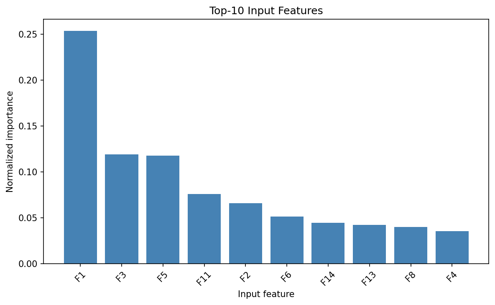
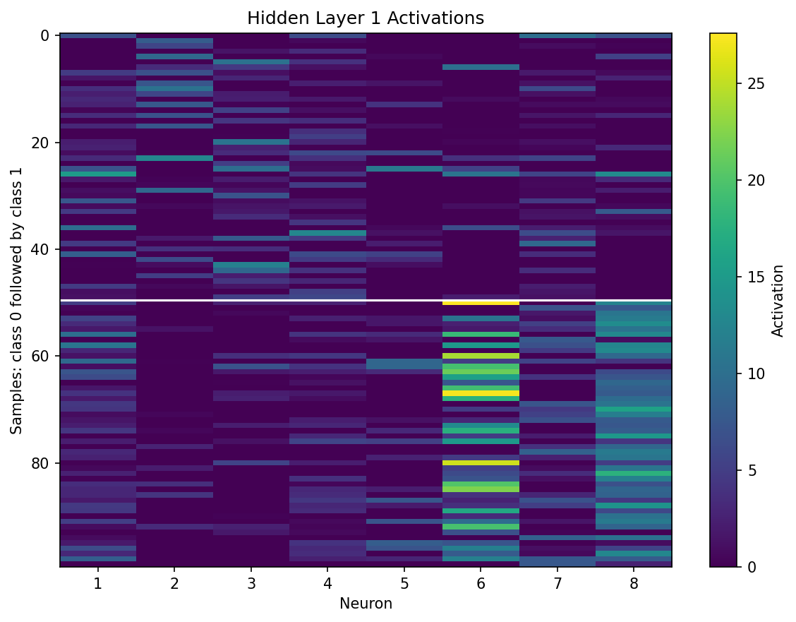
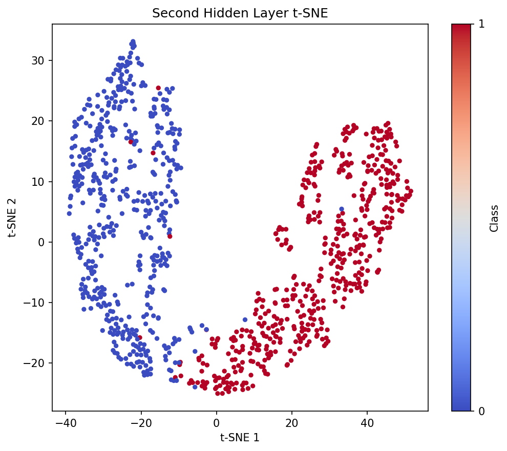
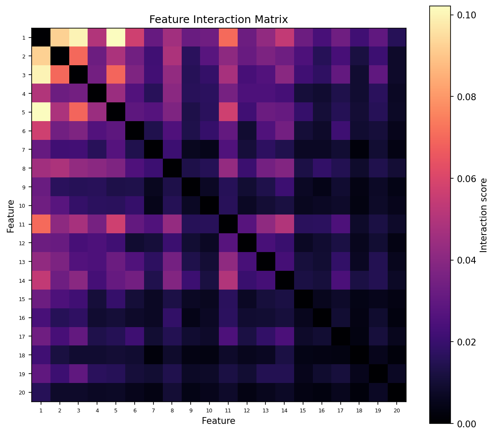
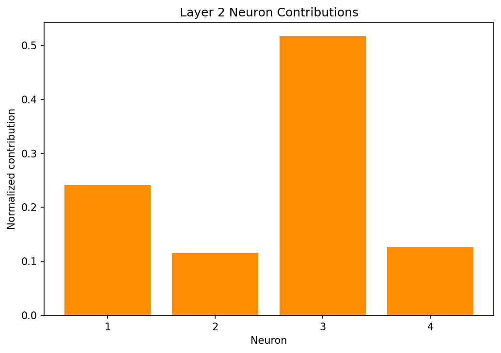
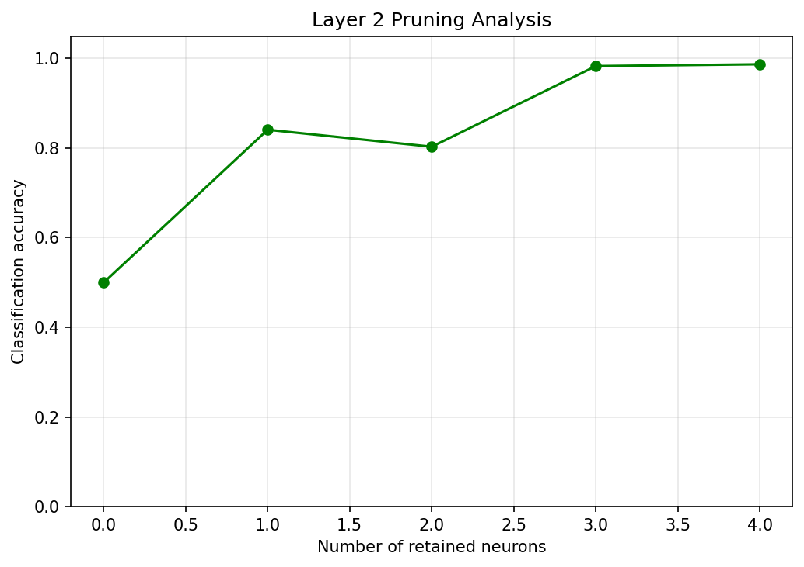
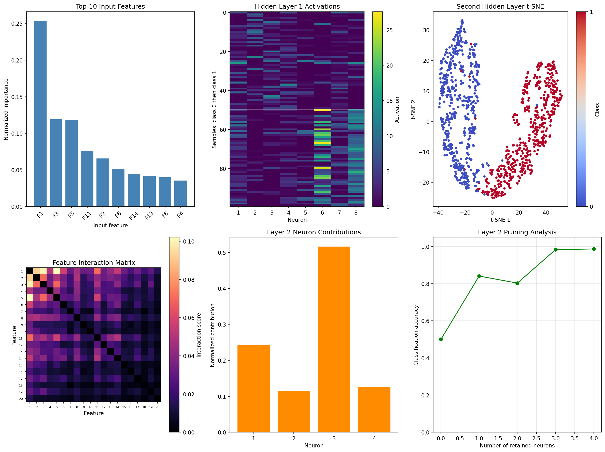

# Problem 3: Neural-Network Behaviour Analysis

## 1. Objective

The objective is to analyse the supplied neural-network classifier for MNIST digits. The model classifies an image as either digit zero or a non-zero digit.

The confirmed architecture is:

```text
20 input features → 8 ReLU neurons → 4 ReLU neurons → 1 sigmoid output
```

The output-label mapping is:

```text
class 1 = digit zero
class 0 = non-zero digit
```

The analysis uses model predictions and hidden-layer activations without manually reading or changing the model weights.

## 2. Data Preparation

Each MNIST image has shape `28 × 28` and is flattened into 784 features. The pixels are normalized using:

```python
X = images.reshape(len(images), -1).astype(np.float32) / 255.0
```

The supplied preprocessor contains a `StandardScaler` and a 20-component PCA model. The confirmed preprocessing order is:

```python
X = preprocessor["scaler"].transform(X)
X = preprocessor["pca"].transform(X)
```

Thus:

```text
784 pixel features → standardization → 20 PCA features
```

The labels are created using:

```python
y = (digit_labels == 0).astype(int)
```

This mapping was verified experimentally:

| Mapping | Accuracy |
|---|---:|
| Class 1 = zero | `0.9946` |
| Class 1 = non-zero | `0.0054` |

## 3. Program Organisation

The model is loaded in `main.py` and passed to the `RE` class:

```python
re = RE(model)
```

The model is stored as `self.model` in `task.py`.

| Purpose | Function |
|---|---|
| Obtain output probabilities | `get_probability()` |
| Convert probabilities to classes | `predict_class()` |
| Extract hidden-layer activations | `get_layer_output()` |
| Calculate input importance | `compute_input_importance()` |
| Analyse hidden layers | `analyze_layer()` |
| Create t-SNE projection | `compute_tsne_projection()` |
| Detect feature interactions | `detect_feature_interactions()` |
| Calculate neuron contributions | `compute_neuron_contributions()` |
| Test neuron pruning | `layer_pruning_analysis()` |

The plotting functions receive axes from `main.py`, so all six plots are combined into one `2 × 3` figure.

## 4. Analysis Sample

To prevent the larger non-zero class from dominating the analysis, `create_balanced_sample()` selects:

```text
500 zero images + 500 non-zero images = 1000 samples
```

The samples are selected and shuffled using random seed 42. The complete test set is used for the overall model accuracy.

## 5. Helper Functions

### `get_probability(X)`

The function calls `model.predict(X)` and returns the sigmoid probabilities:

$$
p_i=P(y=1\mid x_i).
$$

The model output has shape `(n, 1)`. `reshape(-1)` converts it to `(n,)`.

### `predict_class(X)`

The probability is converted to a class using a threshold of 0.5:

$$
\hat y_i=
\begin{cases}
1,&p_i\geq0.5,\\
0,&p_i<0.5.
\end{cases}
$$

### `get_layer_output(X, layer_id)`

An intermediate Keras model is created to return the activation of the requested dense layer.

| Layer | Layer ID | Output shape |
|---|---:|---|
| First hidden layer | `1` | `(n, 8)` |
| Second hidden layer | `2` | `(n, 4)` |

## 6. Task 1: Input-Feature Importance

### Function: `compute_input_importance(X)`

The 20 input features are PCA components. To test feature $j$, its values are shuffled across the samples while all other feature columns remain unchanged.

If $X^{(j)}$ is the input after shuffling feature $j$, its importance is:

$$
I_j=\frac{1}{n}\sum_{i=1}^{n}
\left|P(X_i^{(j)})-P(X_i)\right|.
$$

The raw scores are normalized using:

$$
I_j^{\mathrm{normalized}}=\frac{I_j}{\sum_{k=1}^{20}I_k}.
$$

The function returns the raw scores, normalized scores, ranking, and top-10 feature numbers. The result is displayed using `plot_feature_importance_bar()`.



## 7. Tasks 2 and 3: Hidden-Layer Analysis

### Function: `analyze_layer(X, y, layer_id)`

For every neuron, the function calculates:

- mean activation;
- standard deviation;
- fraction of approximately zero activations;
- mean activation for each class;
- class separation;
- neuron-to-neuron correlation;
- input-feature-to-neuron correlation; and
- silhouette score.

For neuron $j$, class separation is measured by:

$$
C_j=\left|\operatorname{mean}(a_j\mid y=1)-
\operatorname{mean}(a_j\mid y=0)\right|.
$$

A neuron is called dead when at least 95% of its activations are approximately zero. A pair is called redundant when the absolute correlation between their activation patterns is at least 0.95.

`plot_layer_activations()` displays the first hidden-layer activations as a heatmap.



## 8. Second Hidden-Layer t-SNE

### Function: `compute_tsne_projection(layer_analysis)`

The four-dimensional activations of the second hidden layer are projected into two dimensions using t-SNE:

```python
TSNE(n_components=2, random_state=42)
```

The points are coloured according to the zero/non-zero class. This plot is used only for visualization of class separation.



## 9. Task 4: Feature-Interaction Detection

### Function: `detect_feature_interactions(X)`

With 20 features, there are:

$$
\binom{20}{2}=190
$$

unique feature pairs.

For each pair $(i,j)$, the model is evaluated on the original input, each single-feature perturbation, and the combined perturbation. The interaction score is:

$$
D_{ij}=\frac{1}{n}\sum_{k=1}^{n}
\left|f(X_{ij,k})-f(X_{i,k})-f(X_{j,k})+f(X_k)\right|.
$$

A score close to zero indicates an approximately additive effect. A larger score indicates that the combined effect of two features is not simply the sum of their individual effects.

The function returns the interaction matrix, the ten strongest pairs, and the maximum interaction score.



## 10. Neuron Contributions

### Function: `compute_neuron_contributions(layer_analysis)`

For each neuron in the second hidden layer, the contribution score is the difference between its mean activation for the two classes:

$$
C_j=\left|\mu_{1,j}-\mu_{0,j}\right|.
$$

The scores are normalized and ranked. A larger score means that the neuron shows a stronger association with class separation.



## 11. Layer-Pruning Analysis

### Function: `layer_pruning_analysis(y, layer_analysis)`

The neurons are sorted from least to most contributive. The least contributive neurons are progressively removed by setting their activations to zero. The remaining layers of the network are then used to calculate classification accuracy.

The accuracy is:

$$
\operatorname{Accuracy}=\frac{\text{number of correct predictions}}
{\text{total number of predictions}}.
$$

If accuracy remains high after removing neurons, the layer has redundancy. A sharp decrease indicates that the removed neurons contain important information.



## 12. Combined Figure

The six individual plots are combined by `main.py` as follows:

| Position | Plot |
|---|---|
| 1 | Input-feature importance |
| 2 | First hidden-layer activations |
| 3 | Second hidden-layer t-SNE |
| 4 | Feature-interaction matrix |
| 5 | Neuron contributions |
| 6 | Layer-pruning accuracy |

The combined figure is saved as `network_analysis.png`.



## 13. Experimental Results

The complete `main.py` run produced the following results.

### Model and data

| Result | Observed value |
|---|---:|
| Overall model accuracy | `0.9946` |
| Processed input shape | `(10000, 20)` |
| Analysis sample shape | `(1000, 20)` |
| Input scaling | normalized `[0, 1]` |
| Preprocessing order | scaler → PCA |
| Label mapping | class 1 = zero |

### Input importance

| Result | Observed value |
|---|---|
| Top-10 feature ranking | `[1, 3, 5, 11, 2, 6, 14, 13, 8, 4]` |
| Top-10 normalized importance | `[0.25360094, 0.11904958, 0.11790359, 0.07572372, 0.06578021, 0.05105786, 0.04439856, 0.04216986, 0.04009095, 0.03552846]` |

Feature 1 is the most influential feature. Its normalized importance is approximately 25.36%, followed by features 3 and 5.

### Hidden-layer analysis

| Result | First hidden layer | Second hidden layer |
|---|---:|---:|
| Number of dead neurons | `[]` | `[]` |
| Redundant neuron pairs | `[]` | `[]` |
| Silhouette score | `0.2636278649` | `0.4692587508` |

The strongest input feature associated with each first-layer neuron was:

```text
[4, 3, 3, 7, 2, 1, 5, 1]
```

No dead or highly redundant neurons were detected. The higher silhouette score in the second hidden layer indicates better class separation than in the first hidden layer.

### Feature interactions

| Result | Observed value |
|---|---:|
| Maximum interaction score | `0.1021275068` |

The ten strongest interactions were:

```text
(1, 5)   0.1021275068
(1, 3)   0.0998490731
(1, 2)   0.0924993600
(1, 11)  0.0702758962
(2, 3)   0.0698510019
(3, 5)   0.0693880696
(1, 6)   0.0573786499
(5, 11)  0.0571074967
(1, 14)  0.0539277441
(11, 14) 0.0502150215
```

The non-zero interaction scores show that the neural network learns non-additive relationships between some input features.

### Neuron contribution and pruning

| Result | Observed value |
|---|---|
| Second-layer neuron ranking | `[3, 1, 4, 2]` |
| Pruning order, least to most contributive | `[2, 4, 1, 3]` |
| Retained neurons tested | `[4, 3, 2, 1, 0]` |
| Accuracy after pruning | `[0.987, 0.983, 0.803, 0.841, 0.5]` |

Neuron 3 is the most contributive second-layer neuron, while neuron 2 is the least contributive according to the class-mean activation measure. Accuracy is 0.987 with all four neurons and falls to 0.5 when all neurons are removed. The non-monotonic value at one retained neuron is an experimental result of the remaining network, because the effect of a neuron depends on the other neurons retained with it.

## 14. Conclusion

The supplied neural network classifies zero versus non-zero MNIST digits with 99.46% accuracy. Feature perturbation identifies feature 1 as the most influential PCA component. No dead or highly redundant neurons were detected. The second hidden layer gives better class separation than the first layer, as shown by its higher silhouette score. The interaction experiment detects meaningful pairwise feature interactions, confirming that the neural network uses non-linear combinations of input features. The pruning experiment shows that the second hidden layer contains important information, particularly in neuron 3.
